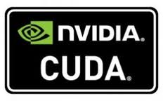

# Ethereum CUDA Miner

 

### Docker container for Ethereum mining with CUDA.

Simple and easy to run, if you have a Nvidia GPU and want to mine eth, be sure to have an eth or geth node running before trying to run this image.

**Note** This image builds the Genoil ethminer and uses stratum to connect to the pool.

### Requirements
- Nvidia drivers for your GPU, you can get them here: [Nvidia drivers](http://www.nvidia.com/Download/index.aspx)
- nvidia-docker (so docker can access your GPU) install instrutions here: [nvidia-docker](https://github.com/NVIDIA/nvidia-docker)

### How to run
```
nvidia-docker run -it -e POOL="YOUR-POOL" -e MINER="YOUR-MINING-ADRESS/POOL-WORKER-URL" anthonytatowicz/eth-cuda-miner:latest

#Example
nvidia-docker run -it -e POOL="us-west1.nanopool.org:9999" -e MINER="0x20ad58fe023265577565c7eb44b55c31e7497c33.cSquared/ajtatowicz@gmail.com" anthonytatowicz/eth-cuda-miner
```
